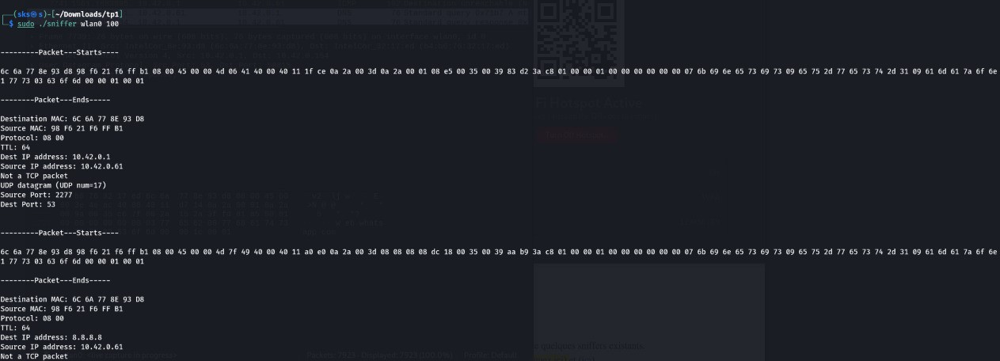

- # TP1

# Attaques passives : sniffing passif

## Deffinition

Les sniffers (appelé aussi « analyseurs de protocoles » ou « analyseurs de réseau ») sont des outils logiciels qui peuvent capturer les trames circulant sur un réseau local et afficher leurs contenus (entêtes des protocoles, identités des utilisateurs, mot de passe non cryptés, etc).

## Objectif

- [Implémenter un sniffer passif simple](#implementation)
- [Manipuler des logiciels de sniffing](#manipulation)

## Outils logiciels

Linux, wireshark, compilateur cc ou gcc

### Implementation

- ## Partie 1 : Implémentation d’un sniffer passif

1)Compilation du code source 

a. (cc -c sniffer_eth_ip_tcp_data.c)
    

b. puis on génére l'exécutable(cc sniffer_eth_ip_tcp_data.c – o sniffer)

2)execution du sniffer en mode root (exemple 10 packet)

3)Dans la manipulation précédente, les trames sont affichées sous format hexadécimal. Pour
afficher le contenu de l’entête ETHERNET, il faut enlever le commentaire de la fonction
ParseEthernetHeader ,recompiler puis régénérer l’exécutable et refaire l’étape 2.

les trames s'affiche comment suivant:

4)Pour Afficher le contenu des entêtes des protocoles des niveaux supérieurs, on enleve les
commentaires des fonctions correspondantes (au niveau de la fonction main).

les trames s'affiche comment suivant:

5)fonction qui permet d’afficher l’entête UDP

### Manipulation

- ## Partie2 : manipulation de sniffers

1)On Lance le logiciel wireshark en arrière- plan

2)On lance des applications d’échange de trafic entre d'autres machines et la notre. Observons-les
paquets capturés

3)Oui, on peut capturer les trafics échangés entre les machines du reste du réseau 

4)Configuration du filtre de wireshark pour :
 a. n'afficher que les trames concernant un protocole particulier : bootp, udp, tcp ,etc
  
  - Bootp
    

  
   - Udp
    

   - Tcp

 b. n'afficher que les trames dont l'adresse MAC destination est celle de votre machine
 
 
 
 c. n'afficher que les trames échangé entre deux machines d'adresse @IP1 et @IP2
 
 
 d. n'afficher que les trames dont la taille est supérieure à une taille donnée

 
